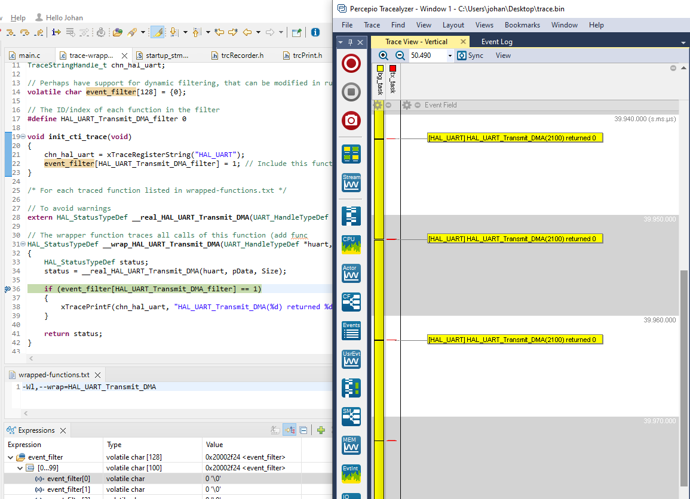

# PoC-WRAP-STM32L4

This is showing how the GCC wrap function can be used to trace function calls without having to insert instrumentation points in the original code.
The tracing is instead done by using a linker feature to hook in to the function calls. You still need to add some code, but this could be automated by a tool.

The functions you like to trace are added in "wrapped-functions.txt" and then you need to add a small trace wrapper function in trace-wrappers.c.
Also started on a filter system to allow for enabling and disabling traced function in runtime (right now you can update the "event_filter" array in the debugger) 

# STM32L4-VCP-Streaming

This project also demonstrates how to stream data at fairly high speed using the Virtual Com Port on the B-L475E-IOT01A1 board. This is driven by USART1 and provided over the STLINK USB connector.
This board uses the older STLINK v2.1 which is limited to about 2 MHz transmission speed. 

With this demo I was able to achive 210 KB/s and with very low overhead (< 1%) thanks to using DMA to offload the CPU.
Note that the initial version of this demo does not contain TraceRecorder, so the tests have been made using dummy data. Need to add that and modularize the UART/DMA code as a new streamport module.

To measure the overhead, I used two tasks. The TX task send data every 10 ms and runs on high priority. The BG task runs on lower priority and updates a counter (bg_counter) as fast as possible for 5 seconds (until a breakpoint is hit). The more time spent in the TX task (and in related ISRs), the less runtime for the BG task. I checked the data rate reported by Tracealyzer and when reaching the breakpoint I noted the bg_counter value. This experiment was repeated with a different number of bytes (sent every 10 ms) and also tested the "baseline" case where no data was sent.

This resulted in the following data:

Sending X bytes every 10 ms

With -O0 optimizations (none)

Bytes  |  Throughtput|	bg_counter |    Diff |		OH %
-------|-------------|-------------|---------|---------
3000   | 		 210 KB/s|  10 323 206 | 119 666 |		1,1%
2100   |     205 KB/s|  10 388 130 |	54 742 |		0,5%
1000   |      98 KB/s|  10 392 639 |	50 233 |		0,5%
(none) |       0 KB/s|  10 442 872 |       - |      -  

With -O1 optimizations

Bytes  |  Throughtput|	bg_counter |    Diff |		OH %
-------|-------------|-------------|---------|---------
3000   |	  210 KB/s |	21 965 633 | 146 226 |		0,6%	
2100	 |	  206 KB/s |	22 063 679 |	48 180 |		0,2%
(none) |	 	  0 KB/s |	22 111 859 |       - |

## What was needed:
1. I generated a basic project for the board using STM32CubeMX and added the FreeRTOS component.
2. Followed this guide (also CubeMX): https://wiki.st.com/stm32mcu/wiki/Getting_started_with_UART#UART_with_DMA
2. Make sure to enable the USART1 global interrupt in CubeMX (this is mentioned but easy to miss)
3. In Tracealyzer PSF Streaming Settings, select "Serial Port" and make sure to set the right speed - matching the settings in MX_USART1_UART_Init (main.c)

Summary of guide (from link in 2, hopefully nothing missed):
- Open the UART.ioc file in the STM32CubeIDE project.
  Under Connectivity - USART1: Add the DMA request "USART_Tx" with the following settings:
    -  Channel: "DMA1 Channel 4"
    -  Direction: "Memory to Peripheral"
    -  Priority "Low"
    -  DMA Request Settings - Mode: "Normal", Increment Address ("Memory" selected)
    -  Data width: "Byte" for both Peripheral and Memory.
  -  Under USART1 - Select NVIC settings and enable USART1 global interrupt

You should now be able to send data using HAL_UART_Transmit_DMA(&huart1, buff, size). The function returns quickly and the DMA transmission continues in the background. If calling HAL_UART_Transmit_DMA again, before the previous transmission is finished, you get return code HAL_BUSY. In that case, delay the task for a millisecond or so and try again.

The USART transmission speed is set in MX_USART1_UART_Init (main.c). It seems as 2200000 (2.2 Mbaud) is the top speed on the B-L475E-IOT01A1. This was tested with an updated STLINK v2 (the onbaord debugger on the board) that had been updated to the latest version from STM32CubeIDE v1.15. When updating it, and I  selected the firmware version "STLINK+VCP", i.e. without Mass storage in case it would cause additional load on the USB bus.

If trying to run the UART too fast settings, you may need to power-cycle the board and/or restart Tracealyzer.
